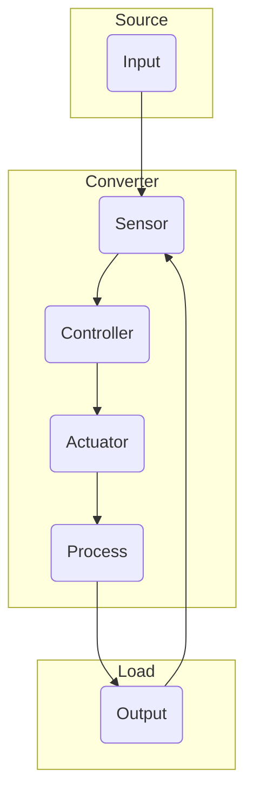

# CONVERTER DESIGN

The Converter class instance consists of a set of components hooked up to the source
and load instances.

The input is a voltage-current pair, of which one of the two
is known to the controller beforehand depending on the control scheme. The source is
given one of these two, and generates the other for inspection. This, along with
the load voltage and current, is nominally known as the sensor outputs plus some
artificially generated noise for good measure. 

The sensor readings are passed into the controller to determine the new control 
setpoint. This controller performs the high level control algorithm that
optimizes for power transfer between the input and output. One example of a high
level control algorithm is an MPPT algorithm, designed for DC-DC conversion. The
controller also performs low level PID loop control. The converter design is
such that the controller algorithm can be swapped without needing to modify the
API. 

The controller then sends an output signal or signals to the actuator. This
actuator represents the actual device topology and is modeled as such. For
example, if the device is a DC-DC converter with a boost topology, then the
device will model input and output capacitors, inductors, and switches.

Finally the actuator output is passed to a process which models the time delay
response of the system. It can be considered as a secondary low pass filter of
the system source and load.

---

## API

The converter shall be able to:

- Read in sensor data from the source and load.
- Run a control algorithm and determine a new voltage or current setpoint, which
  is translated into a actuator signal (e.g. PWM duty cycle).
- Model the actuator topology and adjust the loading conditions based on the
  actuator signal.
- Model the time delay response of the source and load.

