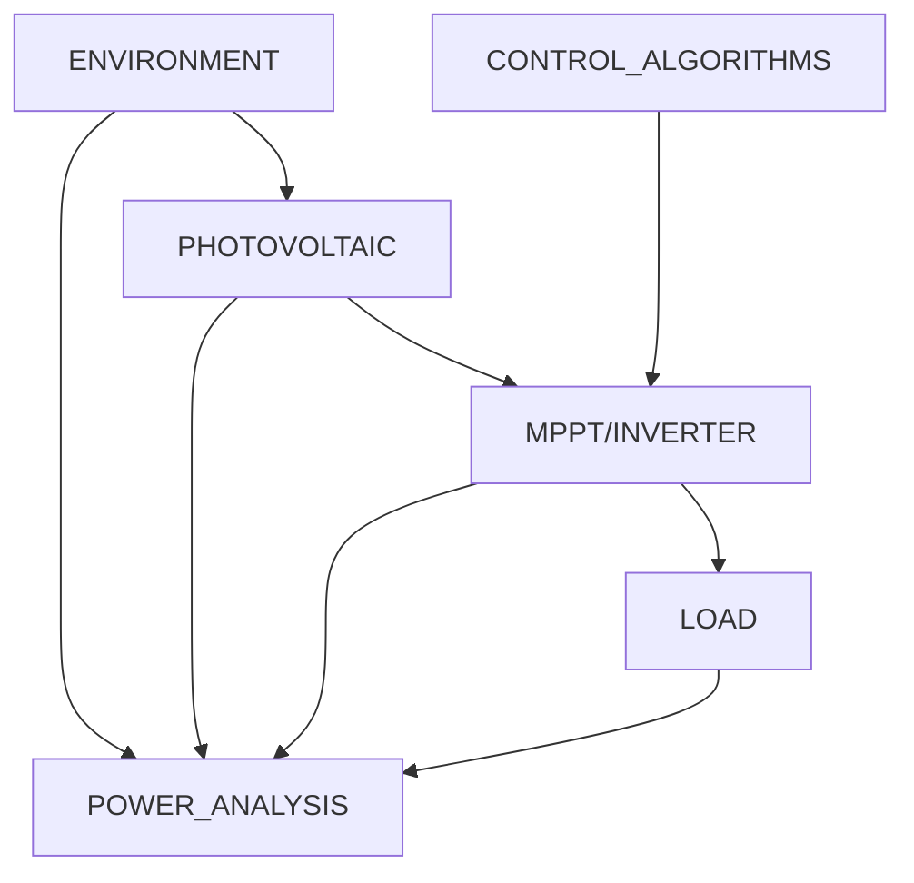

# SYSTEM DESIGN

The system design revolves around the simulation of the entire power generation
chain, modeling the environment all the way to the load. In this simulation
software, the system design allows us to control aspects of the system, in
particular:

- Creation of environmental test regimes,
- Design of a photovoltaic system that mimics that on expected real-world
  deployment,
- Translation of the PV system across the environment through space and time to
  simulate various environmental and shading effects,
- Test topologies and control schemes of the conversion hardware that leverage
  PV generation into usable energy, and
- Analyze output effects into resistive, inductive, and capacitive loads.

